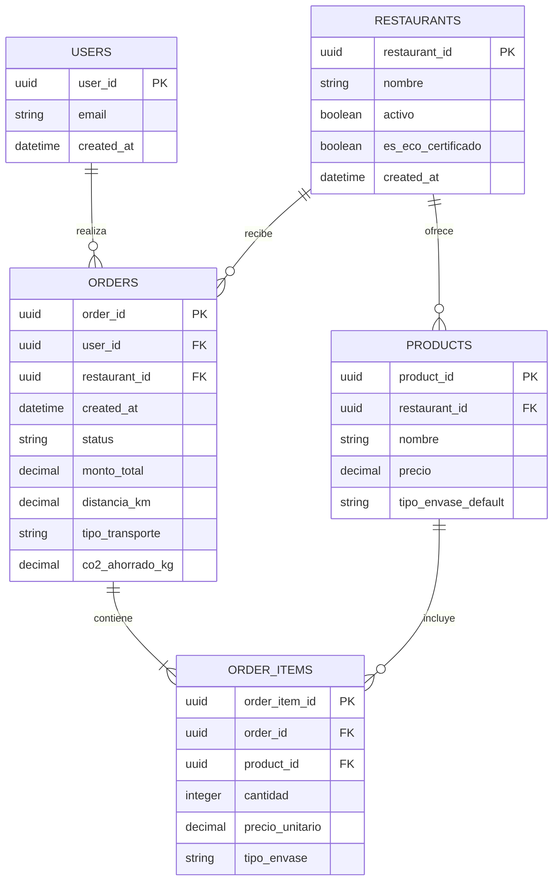

# EcoBite — Diagrama Entidad-Relación

## Relaciones principales

- Un usuario puede realizar muchos pedidos.
- Cada pedido pertenece a un único usuario.
- Un restaurante puede recibir muchos pedidos.
- Cada pedido pertenece a un único restaurante.
- Un restaurante puede ofrecer muchos productos.
- Un pedido contiene uno o más ítems.
- Cada ítem referencia un producto.

Para el MVP se propone que un pedido corresponda a un solo restaurante.
